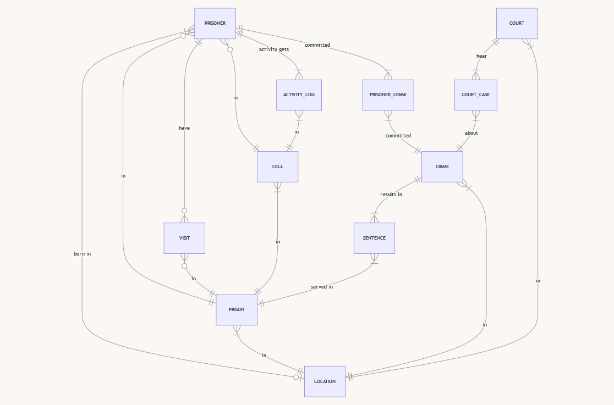

# Design Document

By Mariann Ács-Kovács

#### [LinkedIn profile](https://www.linkedin.com/in/mariann-%C3%A1cs-kov%C3%A1cs-10032b299/)

Video overview: <https://youtu.be/QOU29Io9XaQ>

## Scope

The purpose of the database is to manage and track information related to the incarceration of individuals within the
criminal justice system.

### Included in the scope of the database are:

* **Prisoners**: Including their basic identifying information such as first name, last name, ID number, race group, gender,
date of birth, and contact number. Additionally, the database tracks their date of death, escape attempts, and current
status (active or inactive) for the sake of soft deletion.
* **Crimes**: Recording details about crimes committed by prisoners, including the type of crime, date and time of
occurrence, and the location where the crime took place.
* **Sentences**: Storing information about sentences imposed by courts, including the type of sentence, duration, start and
end dates, and whether parole is granted. Each sentence is associated with the corresponding crime.
* **Prisons**: Representing details about the prisons where sentences are served, including the name, location, and
security level of each facility.
* **Cells**: Describing the cells within prisons, including their names, capacity, and types (such as single, double, or solitary
confinement).
* **Visits**: Tracking visits made by individuals to prisoners, including the visitor's name, date and time of the visit,
and duration.
* **Locations**: Storing information about various locations relevant to the criminal justice system, including birthplaces,
crime locations, prison locations, and court locations.
* **Courts**: Representing courts that decide on sentences, including the court name and location.
* **Activity Log**: Logging activities related to prisoners, such as when they are placed into a cell, released, relocated,
escape, or die. This log helps in monitoring and managing prisoner movements and statuses.

By encompassing these entities, the database facilitates efficient management of prisoner data, crime tracking, sentence
administration, prison management, visitation monitoring, and overall operational activities within the criminal justice
system.

### Out-of-scope:
* Individuals who are awaiting sentencing: The database does not represent people who are considered detainees or
pre-trial detainees because they are not convicted prisoners. They are held in custody pending the outcome of their
trial or sentencing hearing. It can be solved by creating a separate table for these individuals, such as a "Detainees"
table, distinct from the "Prisoners" table. This allows representing their status within the system and differentiate them
from those who have already been convicted and sentenced. Once a verdict is reached and a sentence is assigned,
their status could be updated and transfer them to the appropriate table accordingly.

* House arrest monitoring: This out-of-scope item relates to the absence of functionality for monitoring individuals under
house arrest or community supervision within the current database. It implies that tracking such individuals is beyond
the intended scope of the database's functionalities.

* Hospital transfers: Hospital transfers for imprisoned individuals requiring medical attention beyond the scope of prison
infirmaries are not currently recorded in the database.

## Functional Requirements

The database will support the following functionalities for users:

* Manage Prisoner Information: Users should be able to add, retrieve, update, and delete information about prisoners,
including their personal details, incarceration status, and any associated criminal activities.
* Record Crime Data: Users should be able to input details about crimes committed by prisoners, including the type of
crime, date and time, and location.
* Administer Sentences: Users should have the ability to record sentences imposed by courts, specifying the type of
sentence, duration, and parole status.
* Monitor Prisoner Movement: Users should be able to track activities related to prisoner movements, such as when
they are placed into a cell, released, relocated, escape, or die. This includes maintaining an activity log.
* Manage Prison Facilities: Users should be able to add, update, and delete information about prisons and their
respective cells, including names, capacities, and security levels.
* Track Visits: Users should be able to record details of visits made by individuals to prisoners, including visitor names,
dates and times of visits, and visit durations.
* Document Court Cases: Users should be able to document court cases related to crimes, including court names,
locations, hearing dates, and case law identifiers.
* View Data Insights: Users should have the ability to generate reports or views to analyze trends, statistics, or other
insights related to prisoner demographics, crime patterns, sentence distributions, etc.

The database won't support conducting real-time tracking of prisoner movements within the facility.

## Representation

Entities are captured in SQLite tables with the following schema.

### Entities

The database includes the following entities:

#### Prisoners

The `prisoners` table includes:

* `id`, which specifies the unique ID for the prisoner as an `INTEGER`. This column thus has the `PRIMARY KEY` constraint
   applied.
* `first_name`, which specifies the prisoner's first name as `TEXT`, given `TEXT` is appropriate for name fields. The default
   value for the `first_name` attribute is 'Under identification.'
* `last_name`, which specifies the prisoner's last name. `TEXT` is used for the same reason as `first_name`. The default
   value for the `first_name` attribute is 'Under identification.'
* `id_number`, which specifies the prisoner's identification number. `TEXT` is used because in some countries id_numbers
   can contain letters and numbers at the same time.
* `race_group`, which specifies the prisoner's race/ethnicity as `TEXT`.
* `gender`, which specifies the prisoner's gender as `TEXT`.
* `date_of_birth`, which specifies the prisoner's date of birth as `NUMERIC`.
* `date_of_death`, which specifies the prisoner's date of death as `NUMERIC`. It is necessary to track deaths within prisons.
   The `DEFAULT` value for it is NULL.
* `birth_location`, which specifies the ID of the location where the prisoner is born as an `INTEGER`. This column thus has
   the `FOREIGN KEY` constraint applied, referencing the `id` column in the `locations` table.
* `contact_number`, which specifies the prisoner's relative or acquaintance mobile number as `TEXT`.
* `escape_times`, which specifies how many times the prisoner's escaped from the prison as an `INTEGER`. The `DEFAULT`
   value for it is NULL.
* `prison_id`, which specifies which prison the prisoner is in as an `INTEGER`. This column thus has the `FOREIGN KEY`
   constraint applied, referencing the `id` column in the `prisons` table. Even if it is not necessary to include the `prison_id`
   along with the `cell_id` it ensures data redundancy, facilitates straightforward querying, and aligns with normalization
   principles, offering flexibility and efficiency in database management.
* `cell_id`, which specifies which cell the prisoner is in as an `INTEGER`. This column thus has the `FOREIGN KEY`
  constraint applied, referencing the `id` column in the `cells` table.
* `is_active`, which specifies the prisoner's status as a `BOOLEAN`. It is used for soft deleting a prisoner. The `DEFAULT`
  value for it is true. True means the prisoner is actively serving his prison sentence. False means the prisoner already
  served his prison sentence, or died during it. If a prisoner escapes, the is_active remains true because the prisoner
  still has sentence to serve in prison.

 The `race_group` column has an additional constraint to check if its value is 'White', 'Black/African American',
 'American Indian/Alaska Native', 'Asian', 'Native Hawaiian/Other Pacific Islander',
 'Hispanic', 'Multiracial or some other race', given that these are the valid values for the `race_group`.

Similar to the `race_group` column the `gender` column is also have an additional constraint to check if its value is
'Female' or 'Male'.

Not all columns in the `prisoners` table are required only `first_name`, `last_name`, `id_number`, `race_group`, `gender`,
`is_active` columns, so they have the `NOT NULL` constraint applied.

#### Crimes

The `crimes` table includes:

* `id`, which specifies the unique ID for the crime as an `INTEGER`. This column thus has the `PRIMARY KEY` constraint
   applied.
* `crime_type`, which specifies the type of the crime as `TEXT`.
* `datetime`, which specifies the committed crime's date and time. Timestamps in SQLite can be conveniently stored as `NUMERIC`.
   The default value for the `datetime` attribute is the current timestamp, as denoted by `DEFAULT CURRENT_TIMESTAMP`.
* `crime_location`, which specifies the ID of the location where the crime took place as an `INTEGER`. This column thus has
   the `FOREIGN KEY` constraint applied, referencing the `id` column in the `locations` table.

The `crime_type` column has an additional constraint to check if its value is 'Arms trafficking', 'Arson', 'Assault',
'Corporate crime', 'Counterfeiting', 'Crimes against morality', 'Cybercrime', 'Drug cases', 'Felony', 'Fraud', 'Gun crimes',
'Hate crime', 'Homicide', 'Human smuggling', 'Money laundering', 'Offense', 'Organised crime', 'Police investigation',
'Rape', 'Robbery', 'Sex crimes', 'Vehicle crime', 'Victimless crime', 'Violent crime', given that these are the valid values
for the `crime_type`.

Not all columns in the `crimes` table are required only `crime_type`column, so it has the `NOT NULL` constraint applied.

#### Prisoner crime

The `prisoner_crime` table includes:

* `prisoner_id`, which specifies the ID of a prisoner that committed a crime as an `INTEGER`. This column thus has the
  `FOREIGN KEY` constraint applied, referencing the `id` column in the `prisoners` table.
* `crime_id`, which specifies the ID of a crime that a prisoner committed as an `INTEGER`. This column thus has the
  `FOREIGN KEY` constraint applied, referencing the `id` column in the `crime` table.

The `PRIMARY KEY` of the table is a composite key consisting of both `prisoner_id` and `crime_id`. This means that each
row in the table uniquely identifies a relationship between a specific prisoner and a specific crime.

This table serves as a junction table between the `prisoners` and `crimes` tables, allowing for a many-to-many relationship
between prisoners and crimes. Each row represents a specific crime committed by a specific prisoner.

#### Sentences

The `sentences` table includes:

* `id`, which specifies the unique ID for the sentence as an `INTEGER`. This column thus has the `PRIMARY KEY` constraint
   applied.
* `sentence_type`, which specifies the type of the sentence as `TEXT`.
* `crime_id`, which specifies the ID of a crime that resulted the sentence as an `INTEGER`. This column thus has the
   `FOREIGN KEY` constraint applied, referencing the `id` column in the `crime` table.
* `duration`, which specifies the sentence duration as `TEXT`.
* `start_date`, which specifies the start date of the sentence as `NUMERIC`. Timestamps in SQLite can be conveniently stored
   as `NUMERIC`.
* `end_date`, which specifies the end date of the sentence as `NUMERIC`. Timestamps in SQLite can be conveniently stored
   as `NUMERIC`.
* `parole`, which specifies if the sentence has a parole or not as `BOOLEAN`. The `DEFAULT` value for it is false.
* `parole_date`, which specifies the date of the parole as `NUMERIC`. Timestamps in SQLite can be conveniently stored
   as `NUMERIC`.
* `prison_id`, which specifies the ID of a prison where the sentence has to be served as an `INTEGER`. This column thus
   has the `FOREIGN KEY` constraint applied, referencing the `id` column in the `prisons` table.

The `sentence_type` column has an additional constraint to check if its value is 'Imprisonment', 'Life imprisonment',
'Indeterminate', 'Mandatory minimum', 'Consecutive', 'Probation with imprisonment', given that these are the valid values
for the `crime_type`.

Not all columns in the `sentences` table are required only `sentence_type`, `duration`, `parole` column, so they have the
`NOT NULL` constraint applied.

#### Prisons

The `prisons` table includes:

* `id`, which specifies the unique ID for the prison as an `INTEGER`. This column thus has the `PRIMARY KEY` constraint
   applied.
* `name`, which specifies the prison's name as `TEXT`, given `TEXT` is appropriate for name fields.
* `prison_location`, which specifies the ID of the location where the prison is as an `INTEGER`. This column thus has
   the `FOREIGN KEY` constraint applied, referencing the `id` column in the `locations` table.
* `security_level`, which specifies the prison's security level as `TEXT`.

The `security_level` column has an additional constraint to check if its value is 'Minimum', 'Low', 'Medium', 'High',
'Administrative', given that these are the valid values for the `security_level`.

All columns in the `prisons` table are required and hence should have the `NOT NULL` constraint applied. No other
constraints are necessary.

#### Visits

The `visits` table includes:

* `id`, which specifies the unique ID for the visit as an `INTEGER`. This column thus has the `PRIMARY KEY` constraint
   applied.
* `prisoner_id`, which specifies the ID of a prisoner that had the visit as an `INTEGER`. This column thus has the
   `FOREIGN KEY` constraint applied, referencing the `id` column in the `prisoners` table.
* `prison_id`, which specifies the ID of a prison where the visit took place as an `INTEGER`. This column thus has the
   `FOREIGN KEY` constraint applied, referencing the `id` column in the `prison` table.
* `visitor_name`, which specifies the visitor's full name as `TEXT`, given `TEXT` is appropriate for name fields.
* `visitdatetime`, which specifies the visit's date and time. Timestamps in SQLite can be conveniently stored as `NUMERIC`.
   The default value for the `visitdatetime` attribute is the current timestamp, as denoted by `DEFAULT CURRENT_TIMESTAMP`.
* `visit_duration_minutes`, which specifies the visit's duration in minutes.

All columns in the `visits` table are required and hence should have the `NOT NULL` constraint applied. No other
constraints are necessary.

#### Cells

The `cells` table includes:

* `id`, which specifies the unique ID for the cell as an `INTEGER`. This column thus has the `PRIMARY KEY` constraint
   applied.
* `cell_name`, which specifies the cell's name as `TEXT`. `TEXT` is used because cell names can contain letters and numbers
   at the same time.
* `cell_type`, which specifies the type of the cell as `TEXT`.
* `prison_id`, which specifies the ID of a prison that the cell is in as an `INTEGER`. This column thus has the
   `FOREIGN KEY` constraint applied, referencing the `id` column in the `prison` table.

The `cell_type` column has an additional constraint to check if its value is 'Single', 'Double', 'Dormitory-style housing',
'Solitary confinement', 'Specialized unit', 'Supermax', given that these are the valid values for the `cell_type`.

All columns in the `cells` table are required and hence should have the `NOT NULL` constraint applied. No other
constraints are necessary.

#### Activity log

The `activity_log` table includes:

* `id`, which specifies the unique ID for the activity as an `INTEGER`. This column thus has the `PRIMARY KEY` constraint
   applied.
* `prisoner_id`, which specifies the ID of a prisoner with whom the activity took place as an `INTEGER`. This column thus
   has the`FOREIGN KEY` constraint applied, referencing the `id` column in the `prisoners` table.
* `previous_cell_id`, which specifies which cell the prisoner was before the activity took place as an `INTEGER`. This
   column thus has the `FOREIGN KEY` constraint applied, referencing the `id` column in the `cells` table.
* `current_cell_id`, which specifies which cell the prisoner is in, after the activity took place as an `INTEGER`. This
   column thus has the `FOREIGN KEY` constraint applied, referencing the `id` column in the `cells` table.
* `action`, which specifies the action that took place as `TEXT`.
* `datetime`, which specifies the action's date and time. Timestamps in SQLite can be conveniently stored as `NUMERIC`.
   The default value for the `datetime` attribute is the current timestamp, as denoted by `DEFAULT CURRENT_TIMESTAMP`.

The `action` column has an additional constraint to check if its value is 'Placed into', 'Released', 'Relocated', 'Escaped',
'Died', given that these are the valid values for the `action`.

All columns in the `cells` table are required and hence should have the `NOT NULL` constraint applied. No other
constraints are necessary.

In the `activity_log` table the data is automatically stored with a trigger.

#### Locations

The `locations` table includes:

* `id`, which specifies the unique ID for the location as an `INTEGER`. This column thus has the `PRIMARY KEY` constraint
   applied.
* `country`, which specifies the country of the location as `TEXT`.
* `zip_code`, which specifies the zip code of the location as `TEXT`.
* `state/county`, which specifies the state or the county of the location as `TEXT`.
* `city`, which specifies the city of the location as `TEXT`.

All columns in the `locations` table are required and hence should have the `NOT NULL` constraint applied. No other
constraints are necessary.

#### Court case

The `court_case` table includes:

* `court_id`, which specifies the ID of a court that heared a crime as an `INTEGER`. This column thus has the
  `FOREIGN KEY` constraint applied, referencing the `id` column in the `courts` table.
* `crime_id`, which specifies the ID of a crime that the court heared as an `INTEGER`. This column thus has the
  `FOREIGN KEY` constraint applied, referencing the `id` column in the `crimes` table.

The `PRIMARY KEY` of the table is a composite key consisting of both `court_id` and `crime_id`. This means that each
row in the table uniquely identifies a relationship between a specific court and a specific crime.

This table serves as a junction table between the `courts` and `crimes` tables, allowing for a many-to-many relationship
between courts and crimes. Each row represents a specific crime heard by a specific court.

#### Courts

The `courts` table includes:

* `id`, which specifies the unique ID for the court as an `INTEGER`. This column thus has the `PRIMARY KEY` constraint
   applied.
* `court_name`, which specifies the court's name as `TEXT`, given `TEXT` is appropriate for name fields.
* `court_location`, which specifies the ID of the location where the court is as an `INTEGER`. This column thus has
   the `FOREIGN KEY` constraint applied, referencing the `id` column in the `locations` table.

All columns in the `courts` table are required and hence should have the `NOT NULL` constraint applied. No other
constraints are necessary.

### Relationships

The below entity relationship diagram describes the relationships among the entities in the database.

As detailed by the diagram:

* prisoners—locations: **zero-to-one relationship**
* locations—prisoners: **one-to-many relationship**

A prisoner can have 0 to one birth location: 0 if the birth location is unknown, and one if they have a birth location.
A birth location is associated with one and many prisoners: one if in a location only one prisoner was born, and
many if in a location more than 1 prisoner were born.

* prisoners—prisons: **many-to-one relationship**
* prisons—prisoners: **zero-to-many relationship**

A prisoner can only be in one and only one prison at a time. At the same time, there can be 0 to many prisoners in a
prison: 0 if the prison is permanently closed for some reason, and many if there are more than 1 prisoner in a prison.

* prisoners—visits: **zero-to-many relationship**
* visits—prisoners: **one-to-one relationship**

A prisoner can have 0 to many visits: 0 if the prisoner doesn't have any visitors, and many is they had more than 1 visit.
A visit is associated with one and only one prisoner.

* prisoners—cells: **many-to-one relationship**
* cells—prisoners: **zero-to-many relationship**

A prisoner can be in one and only one cell at a time. At the same time, there can be 0 to many prisoners in a prison: 0
if the cell is empty, and many if there are more than 1 prisoner in a cell.

* prisoners—activity_log: **one-to-many relationship**
* activity_log—prisoners: **many-to-one relationship**

A prisoner can have one or many activity logs: one if the prisoner is inserted to the prisoners table, and many if the
prisoner escaped, died, released or relocated. At the same time, an activity log is about one and only one prisoner.

* prisoners—crimes: **many-to-many relationship**
* crimes—prisoners: **many-to-many relationship**

A prisoner may have committed one or many crimes. At the same time, a crime can be associated with one or many prisoners:
one if the crime was committed by one prisoner, and many if the crime was committed by more than 1 prisoner.
This is represented by a junction table named `prisoner_crime`.

* courts—crimes: **many-to-many relationship**
* crimes—courts: **many-to-many relationship**

A court can hear one or many crimes. At the same time, a crime can be heard by one or many courts: one if the crime is
only heard by one court, and many if the crime may violate multiple laws, each falling under the jurisdiction of different
courts. In such cases, the defendant may face separate charges for each violation, and each charge may be heard by a
different court.
This is represented by a junction table named `court_case`.

* crimes—sentences: **one-to-many relationship**
* sentences—crimes: **one-to-one relationship**

A crime can result in one or many sentences: one if the prisoner's crime got one sentence, and many if the crime, for
example, violates both federal and state laws, it may receive separate sentences from both federal and state courts.
At the same time, a sentence is only associated with one and only one crime.

* sentences—prisons: **many-to-one relationship**
* prisons—sentences: **one-to-many relationship**

If a sentence is imposed, it is given that it can be served in one and only one prison. At the same time, a prison is a
place where there can be one or many sentences to be served.

* prisons—locations: **many-to-one relationship**
* locations—prisons: **one-to-many relationship**

A prison can have one and only one location. A location is associated with one and many prisons: one if in a location only
one prison is located, and many if in a location more than 1 prison is located. This is possible because the locations table
only contains the country, zip code, state/county, and city.

* crimes—locations: **many-to-one relationship**
* locations—crimes: **one-to-many relationship**

A crime can take place in one and only one location. A location is associated with one and many crimes: one if in a location
only one crime took place, and many if in a location more than 1 crime took place.

* courts—locations: **many-to-one relationship**
* locations—courts: **one-to-many relationship**

A court can have one and only one location. A location is associated with one and many courts: one if in a location only
one court is located, and many if in a location more than 1 court is located. This is possible because the locations table
only contains the country, zip code, state/county, and city.

* activity log—cells: **many-to-one relationship**
* cells—activity log: **one-to-many relationship**

One activity log is associated with one and only one cell. At the same time, a cell can have one or many activity logs:
one if the prisoner is inserted to the prisoners table to the cell, and many if the prisoner escaped, died, released or relocated.

* cells—prisons: **many-to-one relationship**
* prisons—cells: **one-to-many relationship**

A cell can only exist in one and only one prison. At the same time, a prison can have one or many cells: one if the prison
only has one cell, and many if the prison has more than 1 cell.

* visits—prisons: **many-to-one relationship**
* prisons—visits: **zero-to-many relationship**

A visit can only be in one and only one prison. At the same time, a prison can have zero or many visits: zero if the prison
restricts the visitations, and many if many visitations take place at one prison.

## Optimizations

### Indexes

* prisoner_activity_log: Beneficial for queries (typical query #12), where activities of a prisoner are retrieved based on
their ID. By indexing the `prisoner_id` column in the `activity_log` table, the database can efficiently locate
relevant activity records for a specific prisoner, speeding up searches and joins.

* prisoner_name_search: Utilized for queries (typical queries #8, #9, and #12), where prisoners are searched by their
first and last names. By indexing the `first_name` and `last_name columns` in the `prisoners` table, the database
can quickly locate records matching specific prisoner names, improving search performance.

* prison_name_search: Useful for queries (typical queries #6 and #7), which retrieve prison information based on the
prison name. By indexing the `name` column in the `prisons` table, the database can swiftly locate prison records by
name, facilitating fast retrieval of prison details.

* prisoner_active: Aids queries (typical queries #1, #2, #3, #4, #6, and #7), where active prisoners are filtered based on
their activity status. By indexing the `is_activ`e column in the `prisoners` table, the database can efficiently identify
active prisoners, improving query performance when filtering by activity status.

* cells_prison_id: It is used (typical queries #6 and #7), where cell information is retrieved based on the prison ID. By
indexing the `prison_id` column in the `cells` table, the database can quickly locate cells associated with a specific
prison, facilitating efficient filtering and joins based on prison IDs.

### Views

* prisons_capacity_and_available_capacity: Queries like typical queries #6 and #7 benefit from this view, providing
information about prison capacity and available capacity. By dynamically calculating available capacity based on
active prisoners, this view allows users to quickly access vital information about prison capacity and utilization without
needing to perform complex calculations manually.

* prisoner_visitors: This view assists with typical query #10 by listing all visits received by a prisoner. By joining multiple
tables (`visits`, `prisoners`, `prisons`, and `locations`), this view consolidates visit-related information, making it
easier for users to retrieve comprehensive visit records for a specific prisoner.

* prisoner_and_cell_info: This view supports typical query #1, #2 and #4, providing detailed information about active
prisoners and their assigned cells. By joining the `prisoners`, `cells`, and `prisons` tables, this view simplifies the
retrieval of prisoner and cell information, enabling users to quickly access relevant details for specific prisoners.

* prisoner_crime_court_sentence: This view supports queries like typical query #8 and #9, providing comprehensive
details about crimes committed by prisoners, along with sentencing and court information. By joining multiple tables
(`prisoner_crime`, `prisoners`, `crimes`, `sentences`, `court_case`, `courts`, and `locations`), this view
consolidates relevant data, making it easier for users to analyze and understand the legal history of specific prisoners.

### Triggers

In any prison management system, it's crucial to track and log significant events related to prisoners. The following triggers
have been implemented to automate the logging process and ensure accurate record-keeping:

* new_prisoner: This trigger ensures that every time a new prisoner enters the system, their placement into a cell is
promptly recorded without manual intervention.

* prisoner_update: This trigger ensures that any changes to a prisoner's status or cell assignment are immediately
logged, providing an accurate and up-to-date history of prisoner activities within the system. It automatically records
various prisoner activities when their details are updated, including placements, releases, deaths, escapes, or
relocations. Additionally, the trigger activates when a prisoner becomes a repeat offender, imprisoned again, or caught
after escaping.

## Limitations

* Inadequate Historical Tracking: The database schema does not explicitly capture historical changes to data over time.
While triggers are implemented to log certain events (e.g., prisoner placements, updates), there may be limitations in
historical tracking, such as tracking changes to sentences, court decisions, or legal precedents, which could be
essential for audit trails or historical analysis.

* Data Privacy and Sensitivity: The database may contain sensitive or personally identifiable information about
individuals involved in criminal incidents, necessitating strict adherence to data privacy regulations and protocols to
safeguard confidentiality and prevent unauthorized access.

* Geographical Coverage: This limitation addresses the database's inadequate representation of geographical
information related to recorded criminal incidents, court locations, and prison locations. The absence of detailed
location data such as street names and house numbers in the `locations` table may result in gaps in data
representation for certain regions or jurisdictions.
